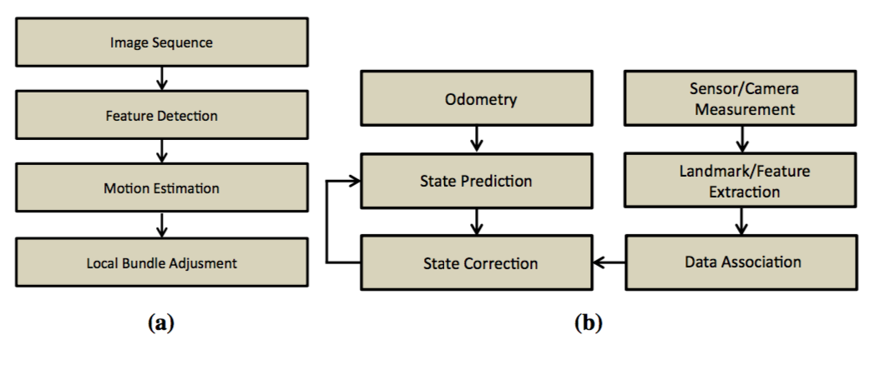

# An Overview to Visual Odometry and Visual SLAM: Applications to Mobile Robotics

## Paper

- Title: Simultaneous Localization and Mapping
- Authors: Khalid Yousif, Alireza Bab-Hadiashar, Reza Hoseinnezhad
- Link: 
- Tags: Visual SLAM · Visual Odometry · Navigation · RGB-D · Autonomous · Mapping	
- Year: 2015

What is this paper about?

- Introduces Visual Odometry and Visual SLAM
- extends on the past surveys of visual odometry [45, 101]
- implementation in RGB-D sensors

## Summary/Notes

- Simplest form of localization is to use **wheel odometry** methods which rely upon wheel encoders to measure the amount of rotation of robots wheels

  - Major limitations:
    - wheeled ground vehicles
    - measurement errors are accumulated over time and cause the estimated robot pose to drift from its actual location
    - wheel slippage

- **Inertial measurement units (IMU)**, **GPU**, **LASER odometry** and most recently **Visual Odometry (VO)** and **Simultaneous Localization and Mapping (SLAM) methods** has been proposed

- VO [101]:

  - process of estimating the **egomotion** of an agent using only the input of a single or multiple cameras attached to it
  - egomotion is defined as the 3D motion of camera within an environment
    - camera's motion relative to a rigid scene
    - i.e., car's moving position relative to lines on the road or street signs being observed from the car itself -> estimation of egomotion is important in autonomous robot navigation applications
    - What: estimation of egomotion
    - Why: figure out robots (relative/global) position 
    - How:
      - visual odometry technique is often used on the sequence of images captured by multiple moving camera(s)
      - Typically done by using **feature** detection to contruct an optical flow from two image frames in a sequence generated by single/mulitple cameras (stereo cameras) 
        - using stereo image pairs for each frame helps reduce error and provides additional depth and scale information
      - features are detected in the first frame, then matched in the second frame
        - used to make the optical flow field for the detected features in those two images
        - used to see how features diverge from a single point (**focus of expansion**)
      - focus of expansion can be detected from the optical flow field which indicates the direction of the motion of camera, and thus provides an estimate of the camera motion
  - particular case of technique known as [Structure from Motion (SfM)](https://en.wikipedia.org/wiki/Structure_from_motion)
    - estimating 3D structures from 2D image sequences that may be coupled with local motion signals
    - [a survey of SfM problem and techniques](https://arxiv.org/abs/1701.084930)
  - VO can be divided into monocular and stereo camera methods
  - further sub-divided in to **feature matching** (matching features over a number of frames [108]), **feature tracking** (matchin features in adjacent frames [31]) and **optical flow techniques** (based on the intensity of all pixels or specific regions in sequential images [118])
  - problem of estimating a robot's egomotion by observing a sequence of images started in 1980s by **Moravec** [82] of Stanford University
    - stereo vision
    - features were matched using Normalized Cross Correlation (NCC)
  - Nister [88] coined the term "Visual Odometry" and pioneered methods for obtaining camera motion from visual motion in both monocular and stereo systems
    - focused on the problem of outliers (false feature matches) and proposed an outlier rejection scheme using **RANSAC** [44]
    - first to track features across all frames instead of matching features in consecutive frames
      - benefit of avoiding feature drift during cross-correlation based tracking [101]
      - RANSAC baed motion estimation using the 3D to 2D reprojection error instead of using the Euclidean distance error between 3D points
        - **3D to 2D reprojection errors** were shown to give better estimates when compared to the 3D to 3D errors
  - Applications:
    - Mission to mars [22] in 2003
    - Kaess [67] proposed a stereo VO system for outdoor naviation in which the sparse flow obtained by feature matching was separated into flow based on close features and flow based on distant features
      - near features: translation
      - distant features: rotation
    - VO used in EKF-SLAM to increase accuracy

- SLAM:

  - process in which robot is required to localize itself in an unknowwn environment and build a map of this environment at the same time without any prior information with the aid of esternal sensors (or a single sensor)

- VO methods perform significantly better than wheel odometry [54] although it does not solve the drift problem

  - [thoughts] visual interial odometry solves this a little bit? ARKit

- Difference between VO and SLAM:

  - VO mainly focuses on local consistency and aims to incrementally estimate the path of the camera/robot pose after pose, and possibly performing local optimization

  - SLAM aims to obtain a globally consistent estimate of the camera/robot trajectory and map

  - Global consistency is achieved by realizing that a previously mapped area has been re-visited (loop closure) and this information is used to reduce drift in the estimates

    
    A block diagram showing the main components of (a) VO and (b) filter based SLAM system

- Visual SLAM

  - SLAM has been extensively studied in the past couple of decades [48, 66, 91]
    - resulting in many different solutions for different sensors (sonar, IR, LASER, etc)
    - recently, there has been increased interest in visual based SLAM (**V-SLAM**)
      - low cost, rich visual information
      - trade-off: high computational cost and requires more sophisticated algorithms for processing the images and extracting necessary informations
        - CPU, GPU
  - RGB-D, TOF, omni-directional techniques has been proposed [28, 78, 70, 103, 56]
  - Davison [28] pioneered V-SLAM
    - single monocular camera and constructed a map by extracting sparse features of the environment using a Shi and Tomasi operator [103]
    - and matched new features to those already observed using a normalized sum-of-squared difference correlation
    - scale of structures had to be calibrated (single monocular)
    - EKF was used for state estimation
      - only limited number of features were extrancted and tracked to manage the computational cost of the EKF
      - [56] proposed a vision based method for mobile robot localization and mapping using the SIFT [77] for feature extraction
  - cv-SLAM (ceiling vision SLAM) was studied by pointing the camera upwards towards the ceiling
    - used for cleaning robots
  - Most recently, there has been an increasing interest in dence 3D reconstruction of the environment as opposed to the sparse 2D and 3D SLAM problems [85]
    - Newcombe and Davison [85] were successful in obtaining a dense 3D model of the environment in real time using a single monocular camera
    - limited to small and highly textured environments
    - Henry [56] were the first to implement an RGB-D mapping approach that employed an RGB-D camera (Kinect)
      - used this information to obtain a dense 3D reconstructed environment and estimated the 6 degree of freedom (**6DOF**) camera pose
      - extracted Features from Accelerated Segment Test (**FAST**) [96] features in each frame, matched them with the features from the previous frame using **Calonder descriptors** [12] and performed a RANSAC alignment step which obtains a subset of feature matches (inliers) that correspond to a consistent rigid transformation [56]
      - transformation was used as an intial guess in the **Iterative Closest Point** (ICP) algorithm which refined the transformation obtained by RANSAC
      - **Sparse Bundle Adjustment** (SBA) [76] was also applied in order to obtain a globally consistent map and loop closure was detected by matching the current frame to previously collected key-frames
    - Endres [41] proposed an RGB-D-SLAM method that uses SIFT, SURF and ORB feature descriptors in place of FAST features
      - used a pose-graph optimization instead of Bundle Adjustment for global optimization
      - Audras [5] proposed an appearance based RGB-D SLAM which avoids the error prone feature extraction and feature matching steps
    - Newcombe [61, 84] proposed a depth only mapping algorithm using RGB-D camera
      - ICP variant method that matches the current measurement to the full growing surface model instead of matching sequential frames
      - segmented outliers (such as moving humans) and divided the scene into foreground and background
      - Usability of their method in **Augmented Relality**
  - Bachrach [8] proposed a VO and SLAM system for unmanned air vehicles (UAVs) using RGB-D camera that relied on extracting FAST features from sequential proprocessed images at different pyramid levels, followed by an initial rotation estimation that limited the size of the search window for feature matching
    - to reduce drift in the motion estimates, they suggested matching the current frame to a selected key-frame instead of matching consecutive frames
  - limitation of RGB-D (not enough depth data) [57]
    - proposed a switching algorithm that heuristically chooses between an RGB-D mapping approach similar to Henry [55] abd 8-point RANSAC monocular SLAM based on availability of depth information
      - two maps were merged using a 3D Iterative Sparse Local Submap Joining Filter (I-SLSJF)
  - Yousif outlined the problem of mapping environments containing limited texture, as such, they proposed [116, 117] that solves this issue by only using depth information for registration using a ranked order statistics based sampling scheme that is able to extract useful points for registration by directly analyzing each point's neighborhood and the orientations of their normal vectors
  - Kerl [69] recently proposed a method that uses both photometric and geometric information 
    - use all of the points for registration and optimize both intensity and depth errors
  - Keller [68] allows for 3D reconstruction of dynamic environemnts by automatically detecting dynamic changes in the scene
  - Dryanovski [33] proposed a fast visual odometry and mapping method that extracts features from RGB-D images and aligns those with a persistent model, instead of frame to frame registration techniques
    - avoid using dense data, feature descriptor vectors, RANSAC alignment, or keyframe-baest bundle adjustment (BA)
    - performance rate of 60Hz using single thread without aid of GPU
  - Summary for this section:
    - earlier methods = sparse 2D and 3D SLAM methods due to limitations of available computational resources
    - recently = dense 3D reconstruction of the environment due to technological advances and availability of efficeint optimization methods

### Localization

- estimates obtained by VO are associated with errors that accumulate over time
- VO is one way of producing localization estimates
  - other include such as wheel odometry
- Motion Estimation:
  - 3 commonly used VO motion estimation techniques called: 3D to 3D, 3D to 2D, and 2D to 2D methods
  - 3D to 3D Motion Estimation:
    - motion is estimated by triangulating 3D feature points observed in a sequence of images
    - transformation between camera frames is then estimated by minimizing the 3D Euclidean distance between the corresponding 3D points
    - $$T = {argmin}_T \sum_i | X_i - T \acute{X}_i |$$
    - where $$T$$ is the estimated transformation and $$X$$ and $$\acute{X}$$ is the 3D feature point in the current frame and the one before
    - $$i$$ is the minimum number of feature paris required to constrain the transformation
    - minimum number of required points depends on the systems' DOF and the type of modling used
      - more points means more computation, but better accuracy
  - 3D to 2D Motion Estimation:
    - similar to previous but here the 2D re-projection error is minimized to find the required transformation
    - $$T = {argmin}_T \sum_i | z - f(T, \acute{X}_i) |$$
    - where $$z$$ is the observed feature point in the current frame, $$f(T, \acute{X}_i)$$ is the reporjection function of it's corresponding 3D feature point in the previous frame
  - 2D to 2D Motion Estimation:
    - 3D to XD transformation is only possible when 3D data are available, which is not always the case
      - estimating the relative transformation between the first two calibrated monocular frames where points have not been triangulated yet
    - in this case, **epipolar geometry** is exploited to estimate this transformation
    - $$q'^T E q = 0$$ is an epipolar constraint
    - $$q$$ and $$q'$$ are corresponding homogeneous image points in two consecutive frames and $$E$$ is the essential matrix
    - $$E = [t]_{x} R$$ 
    - where $$R$$ is the rotation matrix, $$t$$ is the translation matrix given by
    - $$t = [t_x, t_y, t_z]$$
    - where $$[t]_{x}$$ is the skew symmetric matrix
    - full description of different ways to solve the motion estimation using the above approach [75, 86, 119]

### Mapping

- in the real world, maps of the environment in which the mobile robot is required to localize and navigate are not available
  - need to generate map
  - challenging task
- Metric Maps
  - geometric relationship s between the objects and a fixed reference frame
  - Feature Maps:
    - represent the environment in a form of sparse geometric shapes such as points and straight lines
      - location and geometric shape
    - localization is achieved by observing and detecting features and comparing those with the map features that have already been stored
    - uses limited number of sparse objects to represent a map
      - computation can be kept low
    - weakness
      - sensitivity to false data association (measurement that is incorrectly associated to a feature in the map)
      - Data Association (DA) techniques to solve this has been discussed
  - Occupancy Grids:
    - array of cells in which each cell represents a region of the environment
    - unlike feature maps which are concerned about the geometric shape or type of the objects, occupancy grids are only concerned about the occupancy probability of each cell
      - value between 0 (not occupied) and 1 (occupied)
    - DA between the observed measurements and the stored map is performed by similarity based techniques such as cross correlation
    - usefulness of path planning and exploration algorithms 
      - probability can reduce the complexity of the path planning task
    - drawback:
      - computational complexity for large environments
      - tradeoff between accuracy and computational cost can be achieved by reducing the resolution of the map where every cell would represent a larger region
  - Topological Maps
    - Topological Maps are only concerned about adjacency information between objects and avoid metric information as far as possible
    - represented by graph which nodes define places or landmarks and contain distinctive information about them and connecting arcs that manifest adjacency information between the connected nodes
    - very useful in representing a large environment in an abstract form
      - only necessary information are held
    - graph data -> find the shortest path
    - DA is performed by comparing the information obtained from sensor measurements to the distinctive information held at each node
      - place recognition approaches (visual dictionary)
      - other high level feature matching approaches
      - detect loop closures
    - weakness:
      - ensuring reliable navigation between different places without the aid of some form of a metric location measure
      - only qualitative information may not be sufficient for navigation
      - detecting false DA where robots fails to recognize a previously observed place
  - Hybrid (Metric + Topological):
    - metric = more accurate
    - topological = abstract representation
      - useful for path planning

### Simultaneous Localization and Mapping

SLAM attempts to solve localization and mapping problem at the same time.

SLAM's approches has been categorized into filtering approaches (**EKF-SLAM** [106] and **particle filter based SLAM** [81]) and smoothing approaches (such as **GraphSLAM** [111], **RGB-D SLAM** [56], smoothing and mapping [30]).

- Filtering approaches are more concerned with solving the on-line SLAM problem in which only the current robot state and the map are estimated by incorporating sensor measurements as they become available
- Smoothing approaches address the full SLAM problem in which the posterior is estimated over the entire path along with the map, and is generally solved using a least square (LS) error minimization technique

#### Extended Kalman Filter based SLAM

- Most common technique for state estimation and is based on the Bayes filter for the filtering and prediction of non linear functions in which their linear approximations are obtained using a 1st order Taylor series expansion
- EKF is also based on the assumption that the initial posterior has a Gaussian distribution and by applying the linear transformations, all estimated states would also have Gaussian distributions
- Divided into two main stages
  - prediction
    - future position of the robot is estimated based on the robots current position and control input that is applied to it to change it's position
  - update (correction)
- easy to implement and computationally efficient than other filters such as particle filters
- linear approximation of non-linear functions using Taylor expansion can cause inaccurate estimates in some cases
- limitation -> Gaussian density assumption 
  - EKF-SLAM cannot handle the multi-modal densities associated with gloabl localization (localizing the robot without knowledge of its initial position)

#### FASTSLAM 1.0

- [81] popular SLAM technique based on the Rao-Blackwellized particle filter [32]
- 3 main stages:
  - Sampling (drawing $$M$$ particles)
  - updating 
  - re-sampling (based on importance factor)
- In contrast to EKF-SLAM that uses a single EKF to estimate the robot pose and the map, FastSLAM 1.0 uses separate EKFs (consisting of mean and covariance) for each feature and each particle
  - that means the total number of EKFs is $$M \times N$$ where $$N$$ is the total number of features observed

#### Other well-known nonlinear filtering methods

- when motion and observation models are highly non-linear, the EKF can result in a poor performance
  - due to covariance being propagated through linearization of the underlying non-linear model
  - Unscented Kalman Filter and Sigma-Point Kalman Filter address's these known issues
    - using **unscented transform**
      - minimal set of sample points called "sigma points" around the mean are carefully deterministically selected
      - these points are then propageted through the non-linear functions from whcih the mean and covariance of the estimate are then reovered to obtain a Gaussian approximation of the posterior distribution
      - results in a filter that more accurately captures the true mean and covariance in coparison to the EKF
  - Iterated EKF (IEKF) method attempts to improve upon EKF by using the current estimate of the state vector to linearize the measurement equation in an iterative mode until convergence to a stable solution
  - Monte Carlo localization (MCL) [29] is another well known filtering method for robot localization utilizing a particle fitler (similar to FastSLAM)
    - assumes a map of the environment is provided
    - this method estimates the pose of a robot as it moves and senses the environemnt
    - algorithm uses particle filter to represent the distribution of likely states, with each particle representing a possible state
- Particle based filtering in contrast to KF are able to represent multi-modal distributions and thus can re-localize a robot in the **kidnapped situation** (when the localization estimation fails and a robot is lost)

#### Distributed Filtering Methods

- aforementioned filtering methods are based on a single centralized filter in which the entire system state must be reconfigured when the feature points change -> a problem that is particularly evident when mapping dynamic environemnts
- [114] distributed particle filter was proposed in visual SLAM
  - divides the filter to feature point blocks and landmark block
  - requires one-fifth of the computational time when compared to the centralized particle filter

### Fundamental Components in V-SLAM and VO

#### Camera Modeling and Calibration

